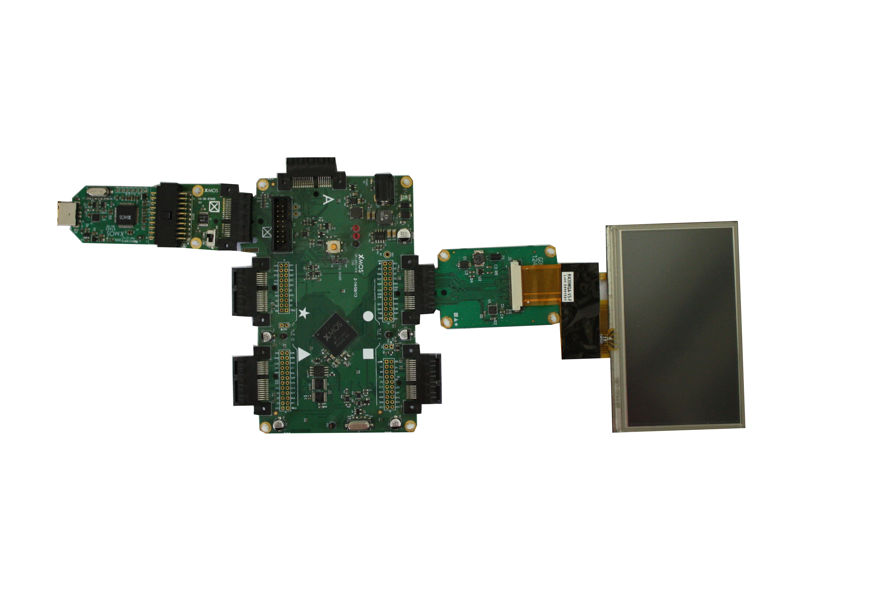

.. include:: ../../README.rst

|newpage|

Overview
--------

Introduction
............

LCD Demo app note demonstrates how the LCD library is used to write image data to the LCD screen. The purpose of this application is to show how data is passed to the lcd_server.

Block diagram
.............

.. figure:: images/block_diagram.*
   :scale: 60%
   :align: center

   Block diagram of LCD application example

LCD demo
--------

This demo application has two major tasks:

   - A task to run the lcd server
   - A task to run the lcd demo

These tasks communicate via the use of xC interfaces.
The following diagrams shows the task and communication structure of the application.

.. figure:: images/task_diagram.*
   :scale: 60%

   Task Diagram

|newpage|

Makefile additions for this example
...................................

To start using the LCD library, add ``lib_lcd`` to the ``Makefile``::

   USED_MODULES = ... lib_lcd

Access the LCD functions in the source code via the header files::

   #include "lcd.h"

Declaring ports
...............

The LCD library connects to external pins via xCORE ports. In ``lcd_demo.xc`` these are declared as variables of type ``port`` in the beginning of the file:

.. literalinclude:: lcd_demo.xc
   :start-after: //port start
   :end-before: //port stop

``lcd_rgb`` has the pixel data in the standard RGB565 format supplied to the LCD over a 16 bit parallel bus. ``lcd_clk`` is the clock line to clock all other signals. ``lcd_data_enabled`` is to indicate that the data on the 16 bit paralell bus is valid. ``lcd_h_sync`` is a signal which sends a pulse to indicate the start of the horizontal scan. ``lcd_v_sync`` is a signal which sends a pulse to indicate the start of the vertical scan. ``lcd_cb`` is a CLOCK BLOCK which provides a regular clock signal to which ever port it is configured to and in this case it is ``lcd_clk``.

Implementation specific defines
...............................

The defines available are:

.. literalinclude:: lcd_demo.xc
   :start-after: //define start
   :end-before: //define stop

- LCD_CLOCK_DIVIDER: This define is used to divide the frequency of the clock block.
- LCD_HOR_FRONT_PORCH: The horizontal front porch timing requirement given in pixel clocks.
- LCD_HOR_BACK_PORCH: The horizontal back porch timing requirement given in pixel clocks.
- LCD_HOR_PULSE_WIDTH: The horizontal pulse width timing requirement given in pixel clocks. This is the duration that the hsync signal should go low to denote the start of the horizontal frame. Set to 0 when hsync is not necessary.
- LCD_VERT_FRONT_PORCH: The vertical front porch timing requirement given in horizontal time periods.
- LCD_VERT_BACK_PORCH: The vertical back porch timing requirement given in horizontal time periods.
- LCD_VERT_PULSE_WIDTH: The vertical pulse width timing requirement given in vertical time periods. This is the duration that the vsync signal should go low to denote the start of the vertical frame. Set to 0 when vsync is not necessary.
- LCD_HEIGHT: This define is used to represent the height of the LCD panel in pixels.
- LCD_WIDTH: This define is used to represent the width of the LCD panel in pixels.
- LCD_BYTES_PER_PIXEL: Count of bytes used to set the pixels RGB value, i.e. if the screen was wired for rgb565 then the LCD_BYTES_PER_PIXEL would be 2, rgb888 would be 3. This is independant of the actual bit depth of the lcd.
- LCD_OUTPUT_MODE: Depending upon the port selected to send the pixels data, it is either selected as ``data16_port16`` or ``data16_port32``.
- LCD_ROW_WORDS: This define indicates the total number of words present.

The header file
...............

The header ``sprite.h`` has the defines and data required for the image of logo ``X`` to be displayed on the LCD screen. The variable ``logo[SPRITE_WIDTH_WORDS * SPRITE_HEIGHT_PX]`` has all the pixel data of the image ``X`` that is displayed on the screen. lib_lcd library keeps on generating a frame with the image to be displayed embedded in it depending on the co-ordinates of the image provided. 

The application main() function
...............................

Below is the source code for the main function of this application, which is taken from the source file ``lcd_demo.xc``

.. literalinclude:: lcd_demo.xc
   :start-on: int main

Looking at this in more detail the following can be observed:

- The par functionality running 8 different parallel tasks.
- ``lcd_server()`` is run on one core of tile 1. This send all the pre-defined parameters to the lib_lcd.
- ``demo()`` which is also run on tile 1 passes the buffer pointer to lib_lcd. 
- A par loop just to keep the other 6 cores busy. Now all the 8 cores of tile 1 are engaged and we can only get 62.5 MIPS. Normally 125MIPS can be achieved until 4 cores.

The demo() function
...................

The ``demo()`` function is given below:

.. literalinclude:: lcd_demo.xc
   :start-on: void demo
   :end-before: //port start

``lcd_init`` must be called before ``lcd_update`` is called. This puts the LCD server into a state ready to accept data. ``lcd_update`` is used to send an array of pixel data to the LCD server. There is a real-time requirement that this function is called often enough to maintain the display. ``lcd_req`` is a function (also a select handler) that acknowledges the LCDs request for the next line of pixel data. The LCD server does no buffering of pixel line arrays, therefore, for every ``lcd_req`` there must be only one ``lcd_update``. Likewise for every ``lcd_update`` there must be only one ``lcd_req``. The pixel array must be on the same tile as the ``lcd_server``. ``x`` and ``y`` variables present in the demo indicate the co-ardinates of the image being displayed on the screen. Currently the image is placed in the centre of the screen. ``add()`` function available in the demo pushes the pixel data value into one of the two buffers available in the demo and ``sub()`` function is used to remove any residue of the ``logo[]`` present in the previous buffer and fill it with the white pixel data. An overview of the the communication between ``demo`` and ``lcd_server`` is shown below:

.. figure:: images/overview.*
   :scale: 60%
   :align: center

   Overview of the LCD demo

|newpage|

Setting up the hardware
.......................

The XP-SKC-A16 sliceKIT Core board(1V0) has four slots with edge connectors: SQUARE, CIRCLE, TRIANGLE and STAR.

To setup up the system:

  - Connect XA-SK-SCR480 Slice Card(1V0) to the XP-SKC-A16 sliceKIT Core board using the connector marked with the CIRCLE.

  - Connect the XTAG Adapter(1V1) to sliceKIT Core board, and connect XTAG-2(1V0) to the Adapter.

  - Connect the XTAG-2 to host PC using a USB extension cable if necessary.

  - Set the XMOS LINK to OFF on the XTAG Adapter.

  - Ensure the jumper P1 on the XA-SK-SCR480 is bridged if the back light is required. Switch on the 12V DC power supply to the sliceKIT Core board.

   Hardware setup for LCD demo

|newpage|

Running the application
.......................

Next step is to run it on the sliceKIT Core Board using the xTIMEComposer tool to load the application over JTAG (via the XTAG2 and XTAG Adapter card) into the xCORE multicore microcontroller.

  - Select the file lcd_demo.xc in the lcd_demo project from the Project Explorer.

  - Click on the Run icon (the white arrow in the green circle).

  - At the Select Device dialog select XMOS XTAG-2 connect to A16[0..1] and click OK. The output on the LCD screen should be a "X" in the centre of the screen.

Next steps
..........

  - Examine the application code. In xTIMEcomposer navigate to the src directory under lcd_demo and double click on the lcd_demo.xc file within it. The file will open in the central editor window. Uncomment the line 89 ie ``move_sprite(x, y, vx, vy)`` and observe what happens! 

  - Trying changing the ``int x=20, y=0, vx=1, vy=2`` variables on line 58, they represent: initial x coord, initial y coord, x velocity and y velocity respectively.

  - In the sub() observe what happens when the line: ``buffer[i] = BACK_COLOUR;`` is changed to buffer[i] = 0x12345678;?

|newpage|

References
----------
  
.. nopoints::

  * XMOS Tools User Guide

    http://www.xmos.com/published/xtimecomposer-user-guide

  * XMOS xCORE Programming Guide

    http://www.xmos.com/published/xmos-programming-guide

  * XMOS LCD Library

    https://www.xmos.com/support/libraries/lib_lcd

|newpage|

Full source code listing
------------------------

lcd_demo.xc
.....................

.. literalinclude:: lcd_demo.xc
  :largelisting:

sprite.h
........

.. literalinclude:: sprite.h
  :largelisting:

|newpage|
